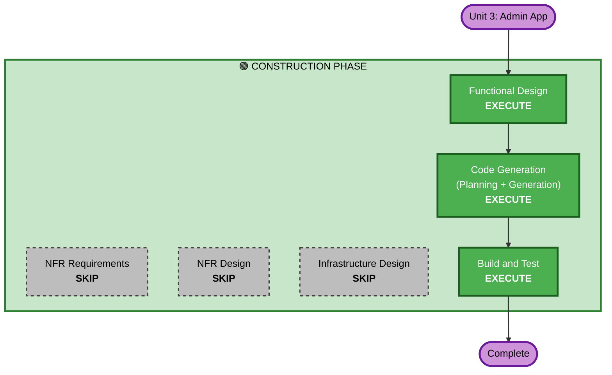

# Execution Plan — Unit 3: Admin App

## 대상 유닛 정보

| 항목 | 내용 |
|------|------|
| **유닛** | Unit 3: Admin App |
| **기술 스택** | Vue.js 3 (TypeScript) + Vite + Pinia |
| **역할** | 관리자 모니터링/관리 화면 |
| **스토리 수** | 18개 |
| **Feature 영역** | Feature 1.1, 6, 7, 8, 9.1 |

---

## 상세 분석 요약

### 변경 영향 평가
- **사용자 대면 변경**: Yes — 관리자가 직접 사용하는 UI 전체
- **구조적 변경**: Yes — 신규 Vue.js 앱 생성 (Greenfield)
- **데이터 모델 변경**: No — Backend API가 담당
- **API 변경**: No — Backend API 스펙에 의존 (소비자)
- **NFR 영향**: Yes — 보안 헤더, 입력값 검증, SSE 연결 관리

### 리스크 평가
- **리스크 수준**: Medium
- **롤백 복잡도**: Easy (독립 프론트엔드 앱)
- **테스트 복잡도**: Moderate (SSE 실시간 통신 테스트 필요)

---

## 워크플로우 시각화



### 텍스트 대안 (Text Alternative)
```
Unit 3: Admin App — Construction Phase
├── Stage 1: Functional Design (EXECUTE)
├── Stage 2: NFR Requirements (SKIP)
├── Stage 3: NFR Design (SKIP)
├── Stage 4: Infrastructure Design (SKIP)
├── Stage 5: Code Generation (EXECUTE)
└── Stage 6: Build and Test (EXECUTE)
```

---

## 실행할 단계 (3개)

### 🟢 CONSTRUCTION PHASE

#### 1. Functional Design — EXECUTE
**근거**: Admin App은 복잡한 UI 상태 관리(SSE 실시간 업데이트, 주문 상태 전이, 테이블 세션 라이프사이클)를 포함하므로 상세 설계가 필요합니다.
- 컴포넌트 구조 설계
- 상태 관리 (Pinia stores) 설계
- SSE 이벤트 핸들링 설계
- 화면 간 네비게이션 플로우

#### 2. Code Generation — EXECUTE (필수)
**근거**: 실제 코드 구현이 필요합니다.
- Part 1: 코드 생성 계획 (파일별 구현 순서)
- Part 2: 코드 생성 실행

#### 3. Build and Test — EXECUTE (필수)
**근거**: 빌드 및 테스트 검증이 필요합니다.
- Vite 빌드 설정
- Vitest 단위 테스트
- fast-check PBT 테스트
- Docker 빌드

---

## 건너뛸 단계 (3개)

#### NFR Requirements — SKIP
**근거**: NFR은 이미 요구사항 문서에서 정의됨 (보안 헤더, 입력값 검증 등). 프론트엔드 앱은 별도 NFR 분석 불필요 — Backend가 핵심 NFR을 담당.

#### NFR Design — SKIP
**근거**: NFR Requirements를 건너뛰므로 NFR Design도 불필요. 보안 관련 사항(CORS, 토큰 관리)은 Functional Design에서 다룸.

#### Infrastructure Design — SKIP
**근거**: Admin App의 인프라는 단순 (Nginx + Docker). docker-compose.yml에서 이미 정의됨. 별도 인프라 설계 불필요.

---

## 성공 기준

- **주요 목표**: 관리자가 실시간으로 주문을 모니터링하고 관리할 수 있는 Vue.js 앱 완성
- **핵심 산출물**:
  - Vue.js 3 프로젝트 (TypeScript, Vite, Pinia)
  - 5개 주요 화면 (로그인, 대시보드, 테이블 상세, 과거 내역, 테이블 설정)
  - SSE 클라이언트 (실시간 주문 수신)
  - JWT 인증 관리
  - Vitest + fast-check 테스트
  - Dockerfile
- **품질 게이트**:
  - 모든 18개 스토리의 Acceptance Criteria 충족
  - Security Extension 규칙 준수 (SECURITY-04, 05, 08, 09, 15)
  - PBT Extension 규칙 준수 (해당 항목)
  - TypeScript 타입 안전성 (strict mode)
